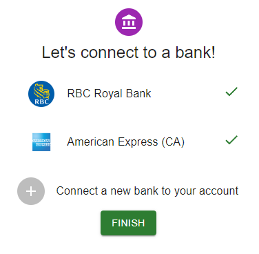
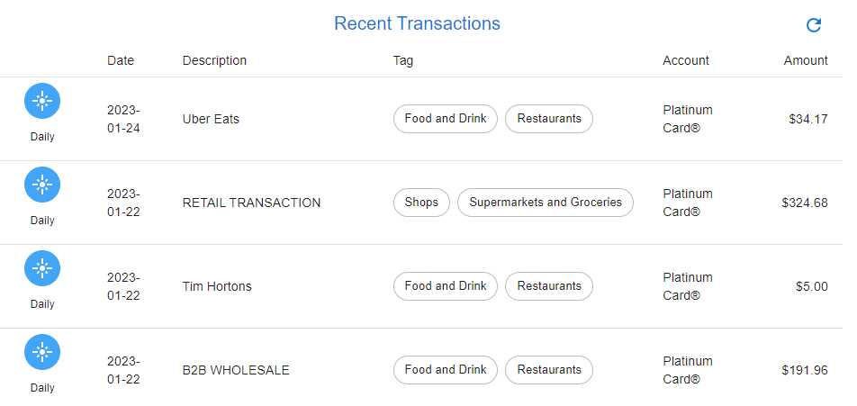
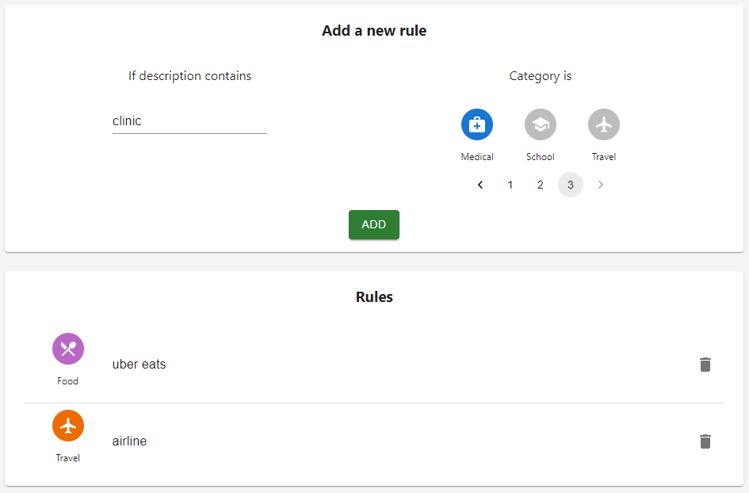
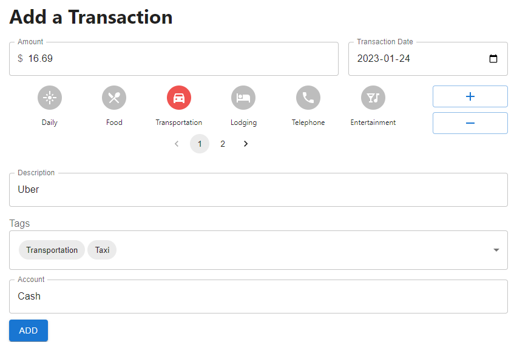
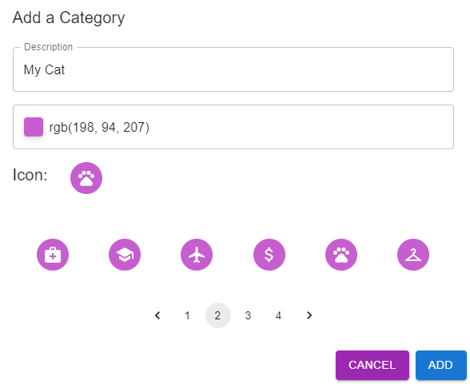
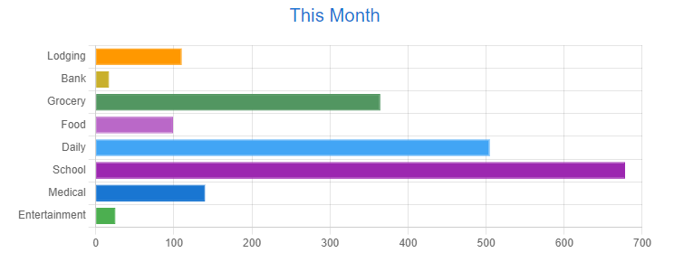

# Bank.ly Front End
The React web front end for the personal finance budgeting app Bank.ly.

[Click here to launch the site!](https://bankly.surge.sh/)

## What does Bank.ly do?

Bank.ly is a personal finance management tool that helps users keep track of their financial transactions and spending habits. By connecting to various financial institutions through the Plaid API, Bank.ly automatically pulls in bank transactions and allows users to easily add and edit them. Users can also create custom tags and categories to better organize their transactions and view detailed spending reports. Additionally, the app is designed to be cross-platform compatible, allowing users to access their financial information on the go.

## Installation

1. Clone the repository: `git clone https://github.com/YOUR_USERNAME/Bank.ly`
2. Install dependencies: `npm install`
3. Start the development server: `npm start`

The app will now be running on `http://localhost:3000`.

## Usage & Key Features

- Easily connect to various financial institutions using [Plaid](https://plaid.com/)

- Automatically pull transactions from financial institutions

- Categorize transactions based on user defined rules

- Add and edit transactions

- Create custom transaction tags and categories

- View spending reports

- Cross platform compatible. [Bankly Mobile](https://github.com/kevban/bankly-mobile)

## Technology Used
- Bankend: Express, Node, MongoDB
- Frontend: React, Redux, Material-UI
- Bank API: Plaid

## Other
- This project was made for Springboard Capstone project 2
- Also see: [Bank.ly bank-end](https://github.com/kevban/bankly-backend), [Bankly Mobile](https://github.com/kevban/bankly-mobile)